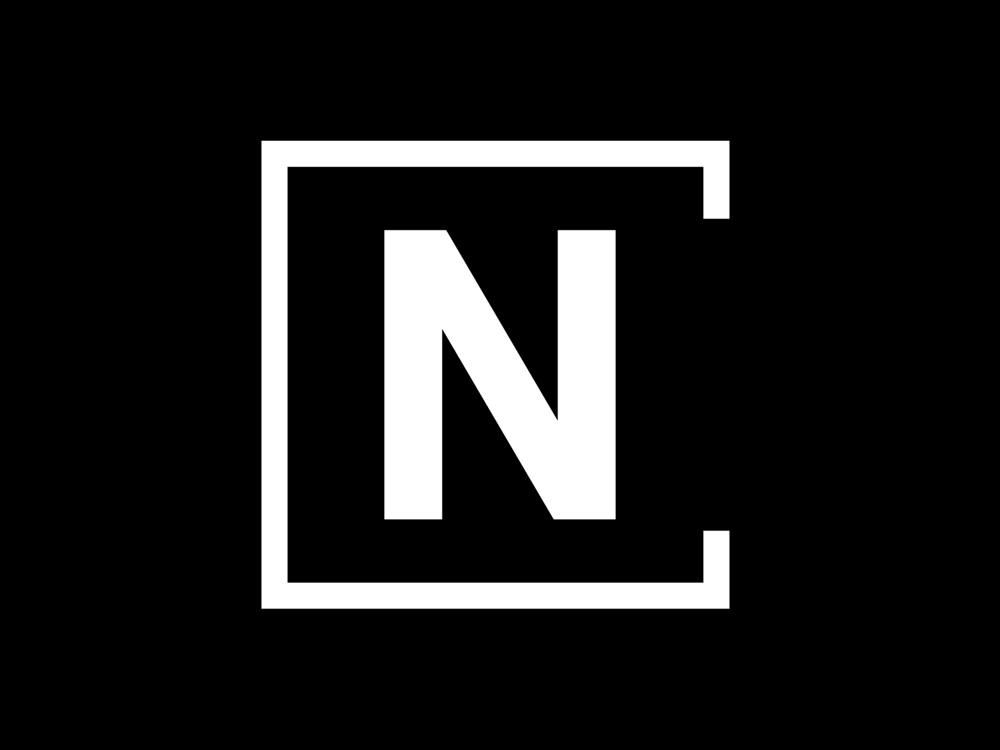

# Neetil Portfolio

A modern, responsive personal portfolio website built with Next.js, TypeScript, and Tailwind CSS. This portfolio showcases projects, skills, testimonials, and provides a contact form - all with a sleek design and excellent user experience.



## Live Demo

Visit the live portfolio: [neetil.in](https://www.neetil.in)

## Features

### UI/UX
- **Responsive Design**: Fully responsive layout that looks great on all devices
- **Dark/Light Theme**: Toggle between dark and light modes with smooth transitions
- **Animations**: Subtle, performant animations for enhanced user experience
- **Music Player**: Background music player with Sunflower track by Post Malone
- **Back-to-Top Button**: Easy navigation for longer scrolling
- **Portfolio AI Assistant**: Interactive AI chat assistant for visitors

### Main Sections
- **Hero Section**: Introduction with profile image and call-to-action buttons
- **About Section**: Detailed bio and skills showcase with animated progress bars
- **Projects Section**: Featured projects with descriptions, technologies, and links
- **Testimonials Section**: Carousel of testimonials with user photos and quotes
- **Contact Section**: Form integrated with EmailJS for direct message delivery

### Technical Features
- **Modern Stack**: Next.js 15 with TypeScript and React 18
- **Component Library**: Uses shadcn/ui components built on Radix UI primitives
- **Styling**: Tailwind CSS for utility-first styling approach
- **Email Integration**: EmailJS for serverless email functionality
- **Theme Management**: next-themes for persistent theme preferences
- **Animations**: Custom CSS animations for smooth section transitions


## Project Structure

```
New-Portfolio/
├── public/            # Static assets
│   ├── images/        # Image files for projects, testimonials, etc.
│   ├── neetil-resume.pdf # Downloadable resume
│   └── sunflower.mp3  # Background music file
├── src/
│   ├── ai/            # AI assistant functionality
│   ├── app/           # Next.js app router pages
│   ├── components/    # React components
│   │   ├── ui/        # UI components from shadcn/ui
│   │   └── ...        # Custom components like header, footer, etc.
│   ├── hooks/         # Custom React hooks
│   ├── lib/           # Utility functions
│   └── providers/     # Context providers
├── .env               # Environment variables
├── package.json       # Dependencies and scripts
└── tailwind.config.ts # Tailwind CSS configuration
```

## Technologies Used

- **Frontend Framework**: Next.js 15
- **Language**: TypeScript
- **UI Library**: React 18
- **Styling**: Tailwind CSS
- **Components**: shadcn/ui (built on Radix UI)
- **Email**: EmailJS
- **Animation**: CSS Animations


## Deployment

The site is currently deployed on Vercel. To deploy your own version:

1. Fork this repository
2. Connect it to your Vercel account
3. Configure environment variables in Vercel dashboard
4. Deploy!


## License

This project is open source and available under the MIT license.

## Contact

For any inquiries, reach out to neetilwork@gmail.com
